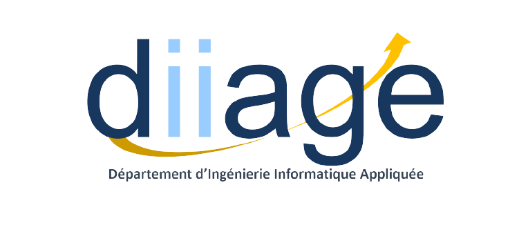
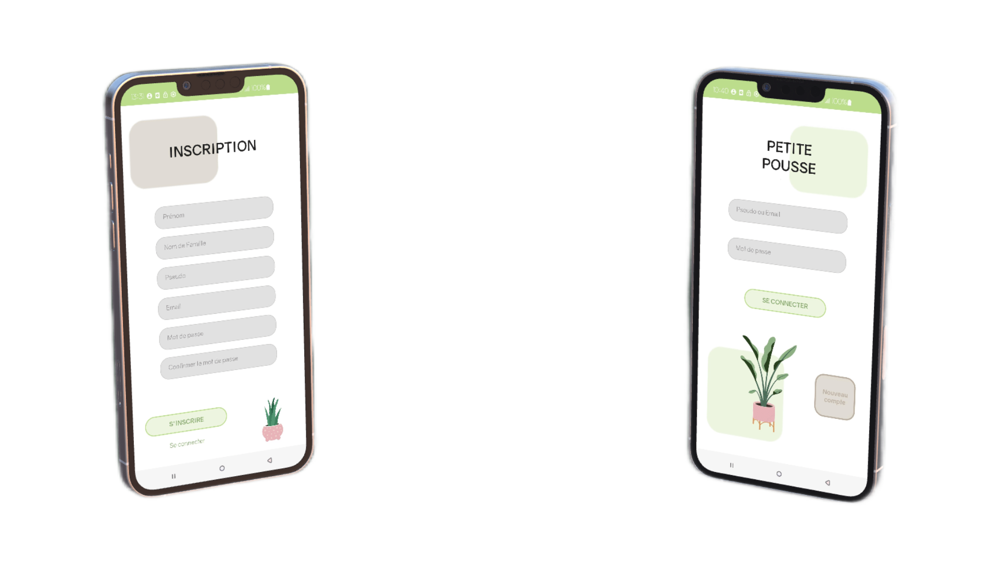

<h1 align="center">Les Petites Pousses</h1>

## Sumuary
This project was carried out as part of our training within the DIIAGE, 
Diploma in Computer Engineering Applied to Business Management.
For this project we had a client who expressed her need to create a 
solution allowing to record audio as well as comments. But also a project 
and meeting creation management and a project sharing system.
We have implemented an authentication system with an email <> password 
couple.

## Technologies

For this project we were imposed 2 technologies, for the front VueJS 3 and 
for the back, for the API, ASP.Net

As for the front, we have added several frameworks, notably Vuetify or 
Bootstrap.

## Project duration

To carry out this project, we had 3 weeks, we were in a team of 5 
fullStack developers and a one systems and networks developers
